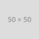

# Welcome to the Game List

A collection of interactive games developed with various JavaScript frameworks.

## Games

### Monk Journey

A journey-based game built with Three.js.

[View Repository](https://github.com/hoanganh25991/threejs-monk-journey) | [Play Game](threejs-monk-journey)

---

### Three.js Warrior V2

An updated version of the Three.js Warrior game with enhanced features.

[View Repository](https://github.com/hoanganh25991/threejs-warrior-v2) | [Play Game](threejs-warrior-v2)

---

### P5.js Soldier

A soldier-themed game created with P5.js.

[View Repository](https://github.com/hoanganh25991/p5js-soldier) | [Play Game](p5js-soldier)

---

### P5.js Tank

A tank battle game built with P5.js.

[View Repository](https://github.com/hoanganh25991/p5js-tank) | [Play Game](p5js-tank)

---

### Three.js Warrior

The original Three.js Warrior game.

[View Repository](https://github.com/hoanganh25991/threejs-warrior) | [Play Game](threejs-warrior)

---

### P5.js Squad

A squad-based strategy game developed with P5.js.

[View Repository](https://github.com/hoanganh25991/p5js-squad) | [Play Game](p5js-squad)

---

## About

This page showcases various games I've developed using JavaScript frameworks like Three.js and P5.js. Feel free to explore the repositories for source code or play the games directly through the provided links.
